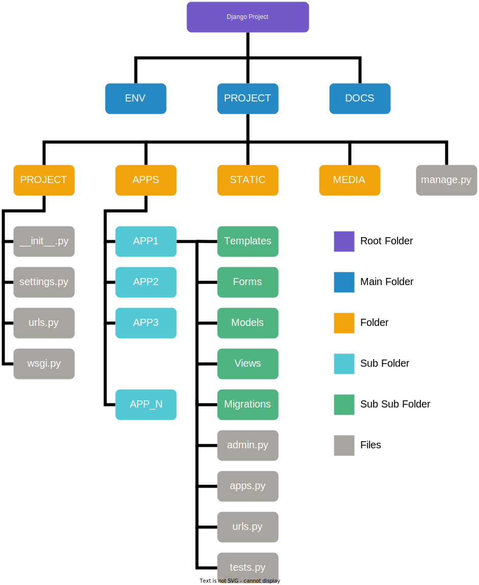

<div align="center">
  <h1 align="center">
    <br>
    <a href="https://gitlab.ums.ac.id/rr867/project-base">
      
    </a>
    <br>
    Project Base
    <br>
  </h1>
</div>


<div align="center">
  <h4 align="center">"Designed to start a new project"</h4>
</div>


<div align="center">
  <p align="center">
    <a href="https://forthebadge.com">
      
    </a>
    <a href="https://forthebadge.com">
      
    </a>
  </p>
</div>


<div align="center">
  <p align="center">
    <a href="https://pypi.org/project/Django/4.2/" title="Django">
      
    </a>
    <a href="https://pypi.org/project/Pillow/9.5.0/" title="Pillow">
      
    </a>
    <a href="https://pypi.org/project/django-hijack/3.3.0/" title="Django Hijack">
      
    </a>
    <a href="https://pypi.org/project/django-cas-ng/4.3.0/" title="Django CAS">
      
    </a>
    <a href="https://pypi.org/project/PyJWT/2.6.0/" title="PyJWT">
      
    </a>
    <a href="https://pypi.org/project/python-decouple/3.8/" title="Python Decouple">
      
    </a>
    <a href="https://pypi.org/project/psycopg2/2.9.6/" title="Psycopg2">
      
    </a>
    <a href="https://pypi.org/project/mysqlclient/2.1.1/" title="Mysqlclient">
      
    </a>
  </p>
</div>


<div align="center">
  <p align="center">
    <a href="#getting-started">View Demo</a> •
    <a href="#contributors-✨">Report Bug</a> •
    <a href="#features">Request Feature</a> •
    <a href="#license">License</a>
  </p>
</div>


<br><br><br>


## Stack

| Name | Description |
| --- | --- |
| Language | Python v3.5+ (Recommended v3.10) |
| Framework | Django v4.2 |
| Template | Ace Admin v4.0.0 |
| Database | Postgresql v14+ / Mysql v8.0+ |


<br><br><br>


## Notes
If you've never used the Django framework before, don't use this base code (project-base), create a dummy project using django, to train yourself in the django framework. If you've used django before, you can use this base code (project-base). So you know the difference.

Before using this project please read the following documentation and references:

<ol>
  <li>Documentation
    <ul>
      <li><a href='https://docs.djangoproject.com/en/4.2/'>Django</a></li>
    </ul>
  </li>

  <li>Principles
    <ul>
      <li><a href='https://testdriven.io/blog/clean-code-python/'>Clean Code in Python</a></li>
    </ul>
  </li>
</ol> 


<br><br><br>


## Getting Started
### Install Requirements
1. Install python 3.10 for this project
2. Install pylaucher if you are using multiple versions of python (optional)
3. Install postgresql database for production
4. Install mysql database for development (optional)


### How to Install Project
To clone and run this application, you'll need [Git](https://git-scm.com) and [Python](https://www.python.org/downloads/) (which comes with [pylauncher](https://pypi.org/project/pylauncher/)) installed on your computer. From your command line:

```bash
$ git clone https://gitlab.ums.ac.id/rr867/project-base.git

$ cd project-base

$ py -3.10 -m venv env (With PyLaucher)

$ python -m venv env (Basic)

$ env/scripts/activate

$ python -m pip install -r docs/requirements.txt


```


### Create Database & File .env
- Create a database in your locale, you can use mysql or postgresql
- Create .env file in the root folder:
  - Copy file .env_dev
  - rename the .env_dev (copy) file to .env
  - then customize the contents


### Create File Migration & Migrate to database
```bash
$ cd project

$ python manage.py makemigrations

$ python manage.py makemigrations authentication

$ python manage.py makemigrations adminpage

$ python manage.py migrate
```


### Load Primary Data in Fixtures Folder (Inside App Services)
```bash
$ python manage.py loaddata group
$ python manage.py loaddata groupdetails
```


### How to Run Project
- If you are running from docker locally and using a local db, change DB_HOST in the env file to -> host.docker.internal
- it will connect with your docker container to local database
```bash
$ python manage.py collectstatic (if DEBUG = False)

# Run the app
$ python manage.py runserver
```


<br><br><br>


## Tips

### Create Secret Key
- After downloading this project, you have to replace SECRET_KEY with the following command. Copy the result and replace SECRET_KEY
```bash
$ python -c 'from django.core.management.utils import get_random_secret_key; print(get_random_secret_key())'
```


### How to Add New Apps
- Go to the apps folder on the terminal
- Type the following command : django-admin startapp appsname
- Open apps.py file and change the value of the name variable. Add "apps." in front of.
- Example : name = 'newapps' change to -> name = 'apps.newapps'


### How to Create Fixtures File
- Type the following command : python manage.py dumpdata appName.modelName
- copy the json string that appears
- Open the following website : [JSON Beautifier Online](https://codebeautify.org/jsonviewer)
- Paste in the form provided and click beautify, then copy the results
- Create a json file inside the services/fixtures folder with the file name according to the model name
- then paste the result and save it


<br><br><br>


## Project Architecture
Best practice for the Django project architecture

<details>
<summary>Desain Architecture (Click Me)</summary>

</details>


<br>


<details>
<summary>Details Architecture (Click Me)</summary>
<!-- <summary></summary> -->

```
.
├── 📦docs
├── 📦env
└── 📦project/
    ├── 📂apps/
    │   ├── 📂services/
    │   │   ├── 📂fixtures/
    │   │   │   └── 📜group.json
    │   │   ├── 📜apps.py
    │   │   ├── 📜apigateway.py
    │   │   └── 📜utils.py
    │   ├── 📂authentication/
    │   ├── 📂landingpage/
    │   └── 📂adminpage/
    │       ├── 📂forms/
    │       ├── 📂migrations/
    │       ├── 📂models/
    │       ├── 📂templates/
    │       │   └── 📂adminpage/
    │       │       ├── 📂account/
    │       │       │   ├── 📜add.html
    │       │       │   ├── 📜edit.html
    │       │       │   └── 📜table.html
    │       │       ├── 📂category/
    │       │       │   ├── 📜add.html
    │       │       │   ├── 📜edit.html
    │       │       │   └── 📜table.html
    │       │       ├── 📂layout/
    │       │       │   ├── 📜base.html
    │       │       │   ├── 📜footer.html
    │       │       │   ├── 📜head.html
    │       │       │   ├── 📜javascript.html
    │       │       │   ├── 📜navbar.html
    │       │       │   └── 📜sidebar.html
    │       │       └── 📜index.html
    │       ├── 📂templatetags/
    │       ├── 📂views/
    │       │   ├── 📜account.py
    │       │   ├── 📜category.py
    │       │   └── 📜dashboard.py
    │       ├── 📜admin.py
    │       ├── 📜apps.py
    │       └── 📜urls.py
    ├── 📂media/
    │   └── 📂images/
    │   └── 📂files/
    ├── 📂project/
    │   ├── 📜asgi.py
    │   ├── 📜settings.py
    │   ├── 📜urls.py
    │   └── 📜wsgi.py
    ├── 📂static/
    │   ├── 📂admin
    │   ├── 📂hijack
    │   ├── 📂images/
    │   │   ├── 📂background
    │   │   ├── 📂email
    │   │   ├── 📂error
    │   │   ├── 📂logo
    │   │   └── 📂profile
    │   └── 📂template
    ├── 📜manage.py
    └── 📜token.json
```
</details>


<br><br><br>


## Features

<ol>
  <li>Landing Page
    <ul>
      <li>Home Page</li>
    </ul>
  </li>
  <li>Authentication Page
    <ul>
      <li>Login Page</li>
      <li>Register Page</li>
      <li>Forgot Page</li>
      <li>Verified Page</li>
      <li>Login SSO (UMS CAS)</li>
    </ul>
  </li>
  <li>Admin Page
    <ul>
      <li>Dashboard Page</li>
      <li>Profile Page</li>
      <li>Sync Profile</li>
      <li>Hijack Feature</li>
      <li>Account Management</li>
      <li>Role Management</li>
      <li>Default CRUD</li>
    </ul>
  </li>
  <li>Other
    <ul>
      <li>API Gateway Helper</li>
      <li>Custom Context Processors</li>
      <li>Authorization Decorator</li>
      <li>Custom Django CAS (Sync With SiHRD)</li>
      <li>Complete Hijack With Session</li>
      <li>Export Data to Excel/PDF</li>
      <li>Multiple Select Data</li>
      <li>Group Details (Table)</li>
      <li>Profile Details (Table)</li>
      <li>Dockerfile & Docker Compose</li>
      <li>Change Debug to False Without Error</li>
      <li>Email Verification</li>
    </ul>
  </li>
</ol> 


<br><br><br>


## Tips and Suggestions

These suggestions can make your life easier in the future

<ol>
  <li>
  Jangan gunakan terlalu banyak library, gunakan yang penting saja agar tidak menyulitkanmu dan orang lain di masa depan (anggota baru harus belajar banyak library).
  </li>
  
  <li>
  Usahakan gunakan library yang memiliki sustainable tingkat tinggi sehingga dapat relevan dalam jangka waktu panjang. (library yang jarang diupdate akan berakibat fatal dikemudian hari).
  </li>
  
  <li>
  Tulis manual requirements.txt file, jangan gunakan pip freeze. (menggunakan pip freeze akan beresiko error saat install project pertamakali). Karena satu library tidak hanya menginstall library itu saja tapi juga library turunannya. Jika menggunakan pipfreeze itu akan terjadi tabrakan karena library sudah terinstall oleh library tertentu tapi diinstall lagi, hal ini berbahaya ketika salah satu library di update.
  </li>

  <li>
  Usahakan jangan terlalu banyak import menggunakan tanda bintang "*" agar memudahkan proses debugging. Terlalu banyak import bintang akan menyulitkan mencari lokasi function atau class yang digunakan.
  </li>

  <li>
  Jangan asal dalam membuat nama variabel, sesuaikan dengan isinya dan jangan membuat variabel hanya dengan satu huruf minimal 3 huruf. Nama variabel yang asal asalan akan membuat proses debugging mu semakin lama.
  </li>

  <li>
  Pahami scope concept dalam membuat sebuah code program. Jangan membuat fungsi general (digunakan di banyak tempat) pada sebuah file yang spesifik. Sehingga codemu lebih modular dan mudah dikembangkan.
  </li>

  <li>
  Usahakan setiap class yang kamu buat memiliki fungsi _str_ dan tampilkan semua variabel yang ada pada class tersebut, hal ini akan mempermudah kamu dalam proses debugging (instance bisa di print dan menampilkan semua data).
  </li>

  <li>
  Jika dirasa orang lain akan sulit memahami codingmu atau bahkan kamu pelupa, jangan malas untuk memberikan komentar/dokumentasi. Komentar dapat memudahkanmu dalam debugging terutama untuk logical error
  </li>

  <li>
  Buatlah nama sebuah variabel, fungsi atau class yang memiliki pola sehingga mundah di tracing/search menggunakan fitur search dan mudah di replace. Seperti gunakan pola setter dan getter. Misal set untuk mengubah sebuah data dan get untuk mengambil sebuah data
  </li>

  <li>
  Pisahkan antara backend (business logic) dan frontend (tampilan), contoh untuk penggunaan forms.py hanya digunakan untuk validasi data dan membuat form insert/update, jangan tambahkan forms.py untuk mengatur css, atur css hanya di tampilan (.html) sehingga tidak menyulitkan untuk custom tampilan
  </li>

  <li>
  Gunakan template tags hanya untuk manipulasi data, tidak digunakan untuk mengambil data baik dari database atau API. Sehinggan memudahkan dalam debugging (tidak mencampurkan business logic dan tampilan)
  </li>

  <li>
  Untuk data yang wajib ada saat pertama kali sistem diinstall, gunakan fitur fixtures pada django. Simpan data pada file dengan ekstensi .json dan simpan dalam folder fixtures. Sehingga pada saat sistem pertama kali diinstall data yang wajib ada pada database dapat di load menggunakan perintah berikut : python manage.py loaddata namafile
  </li>

  <li>
  Urutkan kode program dengan urutan yang tepat. Semisal membuat sebuah variabel yang menyimpan query db untuk mengambi semua data, akan tetapi variabel tersebut baru digunakan setelah beberapa filter if else, sehingga apabila belum masuk if else variabel tersebut tidak digunakan, ini akan boros memori dan menyulitkan saat proses debuging.
  </li>

  <li>
  Pisahkan code program dengan algoritma tertentu, scope code tertentu, fungsi atau class dengan line space/baris kosong/enter, sehingga code program lebih mudah dibaca. Terlihat sepele tapi sangat berpengaruh saat proses debugging.
  </li>

  <li>
  Apabila sudah masuk tahap production, hapus semua migrations lalu buat ulang (python manage.py makemigrations), lalu push/upload semua migrations tersebut ke repository. Folder migrations jangan dimasukan ke .gitignore
  </li>
</ol>


<br><br><br>


## Credits

This software uses the following open source packages:

- [Django==4.2](https://pypi.org/project/Django/4.2/)
- [Pillow==9.5.0](https://pypi.org/project/Pillow/9.5.0/)
- [django-hijack==3.3.0](https://pypi.org/project/django-hijack/3.3.0/)
- [django-cas-ng==4.3.0](https://pypi.org/project/django-cas-ng/4.3.0/)
- [PyJWT==2.6.0](https://pypi.org/project/PyJWT/2.6.0/)
- [python-decouple==3.8](https://pypi.org/project/python-decouple/3.8/)
- [psycopg2==2.9.6](https://pypi.org/project/psycopg2/2.9.6/)
- [mysqlclient==2.1.1](https://pypi.org/project/mysqlclient/2.1.1/)
<!-- - [django-utils-six==2.0](https://pypi.org/project/django-utils-six/2.0/) -->


<br><br><br>


## License

[](/license.txt)


<br><br><br>


## Contributors ✨

Thanks goes to these wonderful people :
<!-- ================================================================== -->
<!--                    ALL-CONTRIBUTORS-LIST:START                     -->
<!--                DO NOT REMOVE or MODIFY THIS SECTION                -->
<!-- ================================================================== -->

<table>
  <tr>
    <td align="center">
      <a href="https://gitlab.ums.ac.id/rr867">
        
        <br />
        <sub>
          <b>Ridwan Renaldi, S.Kom.</b>
        </sub>
      </a>
      <br />
      <a href="" title="Answering Questions">💬</a> 
      <a href="" title="Code">💻</a> 
      <a href="" title="Design">🎨</a> 
      <a href="" title="Documentation">📖</a> 
    </td>
    <td align="center">
      <a href="https://gitlab.ums.ac.id/mhi595">
        
        <br />
        <sub>
          <b>Muhammad Hammam Islami , S.Kom.</b>
        </sub>
      </a>
      <br />
      <a href="" title="Answering Questions">💬</a> 
      <a href="" title="Code">💻</a> 
      <a href="" title="Design">🎨</a> 
    </td>
  </tr>
</table>
